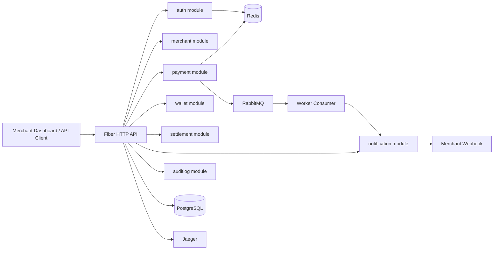

# System Architecture

The application is a modular monolith. Business modules are deployed together, share one database, and communicate through Go interfaces and events. Module boundaries mirror future service boundaries, so `payment`, `wallet`, `settlement`, and `notification` can be extracted later with minimal API and data-flow changes.
