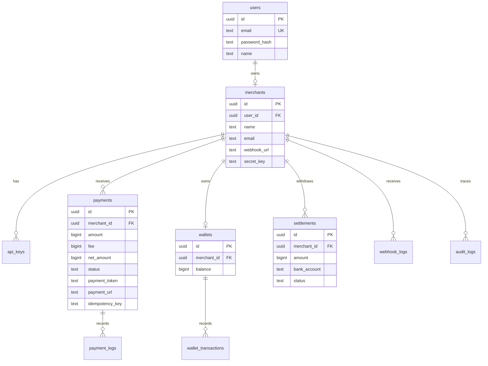

# ERD

```mermaid
erDiagram
  users ||--o| merchants : owns
  merchants ||--o{ api_keys : has
  merchants ||--o{ payments : receives
  payments ||--o{ payment_logs : records
  merchants ||--o| wallets : owns
  wallets ||--o{ wallet_transactions : records
  merchants ||--o{ settlements : withdraws
  merchants ||--o{ webhook_logs : receives
  merchants ||--o{ audit_logs : traces

  users {
    uuid id PK
    text email UK
    text password_hash
    text name
  }
  merchants {
    uuid id PK
    uuid user_id FK
    text name
    text email
    text webhook_url
    text secret_key
  }
  payments {
    uuid id PK
    uuid merchant_id FK
    bigint amount
    bigint fee
    bigint net_amount
    text status
    text payment_token
    text payment_url
    text idempotency_key
  }
  wallets {
    uuid id PK
    uuid merchant_id FK
    bigint balance
  }
  settlements {
    uuid id PK
    uuid merchant_id FK
    bigint amount
    text bank_account
    text status
  }
```
